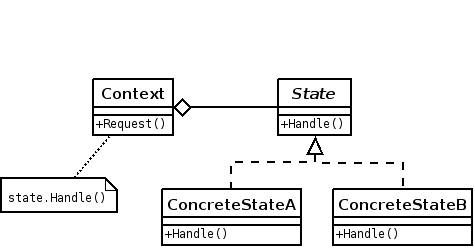

# Pattern State

## Problème

* un objet a un comportement dépendant de son état qui peut changer au cours du temps ;
* une opération contient de nombreuses conditions qui dépendent de l'état de l'objet.

## Description

* Le patron de conception état est utilisé pour modier le comportement d'un objet lorsque son état
interne change. Tout se passera comme si l'objet changeait de classe.
* Le patron état propose deux classes principales :
  * la classe État, qui définit l'abstraction des comportements du patron
  * la classe Contexte, qui s'occupe de l'interfaçage du patron avec le reste de son contexte (l'application).
* La classe État permet via ses spécialisations de créer et gérer dynamiquement les comportements dont l'application aura besoin. La classe Contexte qui permet éventuellement à l'application de choisir le
comportement à mettre en ÷uvre et surtout d'orchestrer l'exécution des comportements. Il est à noter que la classe Contexte n'a pas l'exclusivité du choix de comportements. Il est en eet possible d'automatiser le changement d'état à la n de l'exécution de l'état actif. La classe Contexte garde un lien vers une classe
abstraite État. Chaque comportement est une spécialisation de cet État. Lorsque l'instance de la classe État change, le comportement de l'objet change. Ce patron permet donc à la classe Contexte de changer de comportement dynamiquement sans changer ni d'instance ni d'interface.



## Exemple

``` c++
#include <iostream>
#include <typeinfo>
/**
 * The base State class declares methods that all Concrete State should
 * implement and also provides a backreference to the Context object, associated
 * with the State. This backreference can be used by States to transition the
 * Context to another State.
 */

class Context;

class State {
  /**
   * @var Context
   */
 protected:
  Context *context_;

 public:
  virtual ~State() {
  }

  void set_context(Context *context) {
    this->context_ = context;
  }

  virtual void Handle1() = 0;
  virtual void Handle2() = 0;
};

/**
 * The Context defines the interface of interest to clients. It also maintains a
 * reference to an instance of a State subclass, which represents the current
 * state of the Context.
 */
class Context {
  /**
   * @var State A reference to the current state of the Context.
   */
 private:
  State *state_;

 public:
  Context(State *state) : state_(nullptr) {
    this->TransitionTo(state);
  }
  ~Context() {
    delete state_;
  }
  /**
   * The Context allows changing the State object at runtime.
   */
  void TransitionTo(State *state) {
    std::cout << "Context: Transition to " << typeid(*state).name() << ".\n";
    if (this->state_ != nullptr)
      delete this->state_;
    this->state_ = state;
    this->state_->set_context(this);
  }
  /**
   * The Context delegates part of its behavior to the current State object.
   */
  void Request1() {
    this->state_->Handle1();
  }
  void Request2() {
    this->state_->Handle2();
  }
};

/**
 * Concrete States implement various behaviors, associated with a state of the
 * Context.
 */

class ConcreteStateA : public State {
 public:
  void Handle1() override;

  void Handle2() override {
    std::cout << "ConcreteStateA handles request2.\n";
  }
};

class ConcreteStateB : public State {
 public:
  void Handle1() override {
    std::cout << "ConcreteStateB handles request1.\n";
  }
  void Handle2() override {
    std::cout << "ConcreteStateB handles request2.\n";
    std::cout << "ConcreteStateB wants to change the state of the context.\n";
    this->context_->TransitionTo(new ConcreteStateA);
  }
};

void ConcreteStateA::Handle1() {
  {
    std::cout << "ConcreteStateA handles request1.\n";
    std::cout << "ConcreteStateA wants to change the state of the context.\n";

    this->context_->TransitionTo(new ConcreteStateB);
  }
}

/**
 * The client code.
 */
void ClientCode() {
  Context *context = new Context(new ConcreteStateA);
  context->Request1();
  context->Request2();
  delete context;
}

int main() {
  ClientCode();
  return 0;
}
```

[Exercice 23](../Exercices/Exercice23/README.md)
