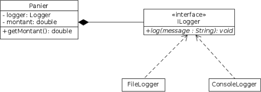

# Inversion des dépendances

**Les modules de haut niveau ne doivent pas dépendre des modules de bas niveau : les deux doivent dépendre d'abstraction. Les abstractions ne doivent pas dépendre des détails, les détails doivent dé-pendre des abstraction.**

Un module (généralement une classe) A dépend d'un autre module (généralement une classe également) B lorsque A utilise une instance de B (en attribut, ou par un appel à une méthode).
Les modules de haut niveau contiennent généralement le c÷ur métier de l'application, alors que les modules de bas niveau contiennent les implémentations dépendantes du système, du stockage (lecture /
écriture de chiers, logs par exemple), ou de serveurs externes (connexion avec une base de données, la sérialisation, etc.).

Par exemple, si une classe utilise du code pour se connecter à un server MySQL, et qu'on décide par la suite de pouvoir également se connecter à un server Postgresql, il va falloir modiliser le code de la classe,
la recompiler et la redéployer.
Prenons l'exemple d'une classe Panier représentant un panier d'achats, utilisant une classe Logger pour écrire dans des logs le montant du panier.

# Exemple


On veut désormais pouvoir loguer dans la console . . . il faut ajouter une méthode ```logConsole(std::string message)``` dans la classe Logger (car la méthode ```log(String message)``` est sûrement déjà utilisée ailleurs) et modifier la classe Panier, voire sûrement d'autres : mauvaise conception !

On va inverser la dépendance du code en mettant en place une abstraction
: la classe Panier va maintenant dépendre d'une abstraction de la classe Logger (une interface) et non plus directement de la classe Logger, et les classes concrètes de logs dérivent de l'abstraction.


