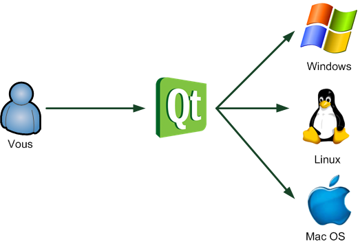

# Presentation

Bien plus qu'une bibliothèque. C'est un ensemble de bibliothèques. Le tout est tellement énorme qu'on parle d'ailleurs plutôt de framework : cela signifie que vous avez à votre disposition un ensemble d'outils pour développer vos programmes plus efficacement.

Qt est fondamentalement conçue pour créer des fenêtres, c'est en quelque sorte sa fonction centrale. Mais ce serait dommage de la limiter à cela.

Qt est donc constituée d'un ensemble de bibliothèques, appelées « modules ». On peut y trouver entre autres ces fonctionnalités :

* **Module GUI** : c'est toute la partie création de fenêtres. Nous nous concentrerons surtout, dans ce cours, sur le module GUI.

* **Module OpenGL** : Qt peut ouvrir une fenêtre contenant de la 3D gérée par OpenGL.

* **Module de dessin** : pour tous ceux qui voudraient dessiner dans leur fenêtre (en 2D), le module de dessin est très complet !

* **Module réseau** : Qt fournit une batterie d'outils pour accéder au réseau, que ce soit pour créer un logiciel de Chat, un client FTP, un client Bittorent, un lecteur de flux RSS…

* **Module SVG** : Qt permet de créer des images et animations vectorielles, à la manière de Flash.

* **Module de script** : Qt prend en charge le Javascript (ou ECMAScript), que vous pouvez réutiliser dans vos applications pour ajouter des fonctionnalités, par exemple sous forme de plugins.

* **Module XML** : pour ceux qui connaissent le XML, c'est un moyen très pratique d'échanger des données à partir de fichiers structurés à l'aide de balises, comme le XHTML.

* **Module SQL** : permet d'accéder aux bases de données (MySQL, Oracle, PostgreSQL…).

Qt est énorme, et il ne faut pas compter sur un seul livre pour vous expliquer tout ce qu'il y a à savoir sur Qt. Je vais vous montrer un large éventail de ses possibilités mais nous ne pourrons jamais tout voir. Nous nous concentrerons surtout sur la partie GUI.
Pour ceux qui veulent aller plus loin, il faudra lire [la documentation officielle](https://doc.qt.io/) (uniquement en anglais, comme toutes les documentations pour les programmeurs). Cette documentation est très bien faite, elle détaille toutes les fonctionnalités de Qt, même les plus récentes.

## Qt est multiplateforme

Qt est un framework multiplateforme. Le schéma de la figure suivante illustre le fonctionnement de Qt.
Abstraction offerte par Qt

Grâce à cette technique, les fenêtres que vous codez ont une apparence adaptée à chaque OS. Vous codez pour Qt et Qt traduit les instructions pour l'OS. Les utilisateurs de vos programmes n'y verront que du feu et ne sauront pas que vous utilisez Qt.

## Qt Creator

Bien qu'il soit possible de développer en C++ avec Qt en utilisant notre IDE (comme Code::Blocks) je vous recommande fortement d'utiliser l'IDE Qt Creator que nous venons d'installer. Il est particulièrement optimisé pour développer avec Qt. En effet, c'est un programme tout-en-un qui comprend entre autres :

* un IDE pour développer en C++, optimisé pour compiler des projets utilisant Qt (pas de configuration fastidieuse) ;

* un éditeur de fenêtres, qui permet de dessiner facilement le contenu des interfaces à la souris ;

* une documentation indispensable pour tout savoir sur Qt.
