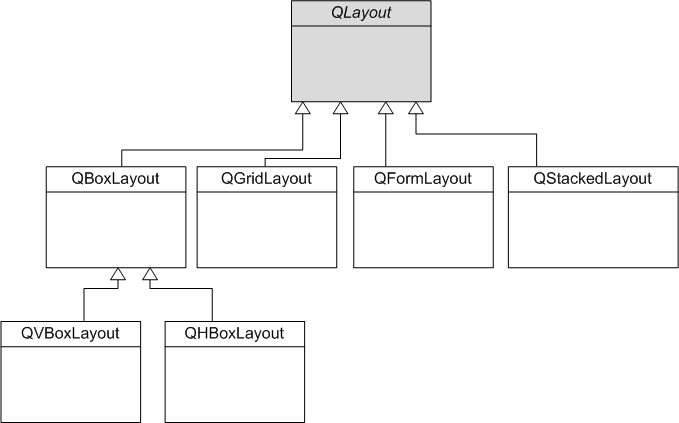
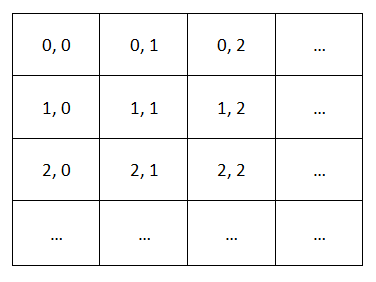
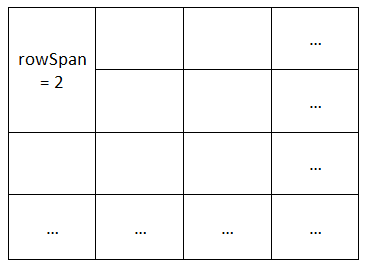

# Les layouts

On distingue deux techniques différentes pour positionner des widgets :

* Le positionnement absolu : avec l'appel à la méthodesetGeometry(ou move)... Ce positionnement est très précis car on place les widgets au pixel près, mais cela comporte un certain nombre de défauts comme nous allons le voir.

* Le positionnement relatif : c'est le plus souple et c'est celui que je vous recommande d'utiliser autant que possible.

## Le positionnement absolu et ses défauts

``` c++
#include <QApplication>
#include <QPushButton>

int main(int argc, char *argv[])
{
    QApplication app(argc, argv);

    QWidget fenetre;

    QPushButton bouton("Bonjour", &fenetre);
    bouton.move(70, 60);

    fenetre.show();

    return app.exec();
}
```

Ce positionnement n'est pas souple et ne permet pas le redimensionnement de la fenêtre car le bouton ne bouge pas et le bouton peut devenir partiellement caché.

L'utilisation de la fonction ```setFixedSize()``` sur la fenêtre ne résoud que partiellement le problème car si l'utilisateur a une résolution plus petite que votre fenêtre celle-ci ne sera pas entièrement visible.

Le positionnement relatif est géré dans Qt par ce qu'on appelle les **layouts**. Ce sont des conteneurs de widgets.

## L'architecture des classes de layout

Pour positionner intelligemment nos widgets, nous allons utiliser des classes de Qt gérant les layouts.
Il existe par exemple des classes gérant le positionnement horizontal et vertical des widgets (ce que nous allons étudier en premier) ou encore le positionnement sous forme de grille.



## Les layouts horizontaux et verticaux

Nous allons travailler sur deux classes :

* QHBoxLayout
* QVBoxLayout

### Le layout horizontal

L'utilisation d'un layout se fait en 3 temps :

1. On crée les widgets
2. On crée le layout et on place les widgets dedans
3. On dit à la fenêtre d'utiliser le layout qu'on a créé.

#### 1. Créez les widgets

``` c++
QPushButton *bouton1 = new QPushButton("Bonjour");
QPushButton *bouton2 = new QPushButton("les");
QPushButton *bouton3 = new QPushButton("copains");
```

#### 2. Créez le layout et placer les widgets dedans

``` c++
QHBoxLayout *layout = new QHBoxLayout;

layout->addWidget(bouton1);
layout->addWidget(bouton2);
layout->addWidget(bouton3);
```

#### 3. Indiquez à la fenêtre d'utiliser le layout

``` c++
fenetre.setLayout(layout);
```

ce qui nous donne : 

``` c++
#include <QApplication>
#include <QPushButton>
#include <QHBoxLayout>


int main(int argc, char *argv[])
{
    QApplication app(argc, argv);

    QWidget fenetre;

    QPushButton *bouton1 = new QPushButton("Bonjour");
    QPushButton *bouton2 = new QPushButton("les");
    QPushButton *bouton3 = new QPushButton("copains");

    QHBoxLayout *layout = new QHBoxLayout;
    layout->addWidget(bouton1);
    layout->addWidget(bouton2);
    layout->addWidget(bouton3);
    
    fenetre.setLayout(layout);
    
    fenetre.show();

    return app.exec();
}
```

### Le layout vertical

``` c++
#include <QApplication>
#include <QPushButton>
#include <QVBoxLayout>


int main(int argc, char *argv[])
{
    QApplication app(argc, argv);

    QWidget fenetre;

    QPushButton *bouton1 = new QPushButton("Bonjour");
    QPushButton *bouton2 = new QPushButton("les");
    QPushButton *bouton3 = new QPushButton("copains");

    QVBoxLayout *layout = new QVBoxLayout;
    layout->addWidget(bouton1);
    layout->addWidget(bouton2);
    layout->addWidget(bouton3);

    fenetre.setLayout(layout);

    fenetre.show();

    return app.exec();
}
```

### Le layout de grille

Il faut imaginer que votre fenêtre peut être découpée sous la forme d'une grille avec une infinité de cases, comme à la figure suivante.



Si on veut placer un widget en haut à gauche, il faudra le placer à la case de coordonnées (0, 0).

Si on veut en placer un autre en-dessous, il faudra utiliser les coordonnées (1, 0) et ainsi de suite.

#### Utilisation

``` c++
#include <QApplication>
#include <QPushButton>
#include <QGridLayout>


int main(int argc, char *argv[])
{
    QApplication app(argc, argv);

    QWidget fenetre;

    QPushButton *bouton1 = new QPushButton("Bonjour");
    QPushButton *bouton2 = new QPushButton("les");
    QPushButton *bouton3 = new QPushButton("copains");

    QGridLayout *layout = new QGridLayout;
    layout->addWidget(bouton1, 0, 0);
    layout->addWidget(bouton2, 0, 1);
    layout->addWidget(bouton3, 1, 0);

    fenetre.setLayout(layout);

    fenetre.show();

    return app.exec();
}
```

#### Un widget qui occupe plusieurs cases

L'avantage de la disposition en grille, c'est qu'on peut faire en sorte qu'un widget occupe plusieurs cases à la fois. On parle de spanning (ceux qui font du HTML doivent avoir entendu parler des attributs row span et colspan sur les tableaux).

Pour ce faire, il faut appeler une version surchargée deaddWidgetqui accepte deux paramètres supplémentaires : lerowSpanet lecolumnSpan.

* rowSpan: nombre de lignes qu'occupe le widget (par défaut 1)
* columnSpan: nombre de colonnes qu'occupe le widget (par défaut 1)

Imaginons un widget placé en haut à gauche, aux coordonnées (0, 0). Si on lui donne un rowSpan de 2.



### Le layout de formulaire

Le layout de formulaire ```QFormLayout``` est un layout spécialement conçu pour les fenêtres hébergeant des formulaires.

Un formulaire est en général une suite de libellés (« Votre prénom : ») associés à des champs de formulaire (une zone de texte par exemple)

