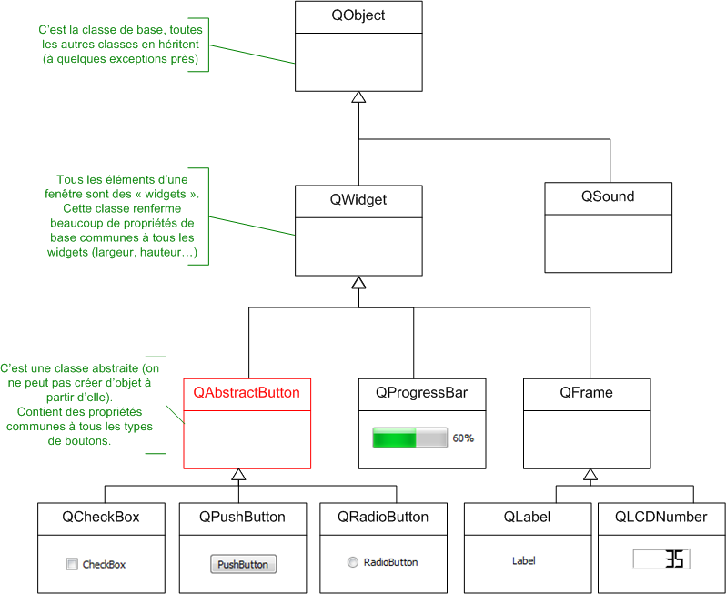
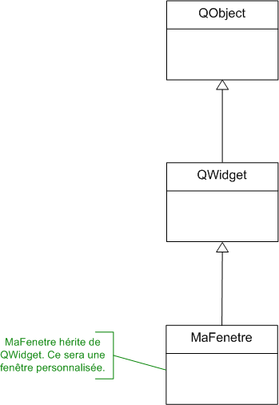

# Le code minimal d'un projet Qt

``` c++
#include <QApplication>
 
int main(int argc, char *argv[])
{
    QApplication app(argc, argv);
 
    return app.exec();
}
```

## Explication

``` c++
#include <QApplication>
```

C'est le seul include dont vous avez besoin au départ. Vous pouvez oublier iostreamet compagnie, avec Qt on ne s'en sert plus.

Cet include vous permet d'accéder à la classe QApplication, qui est la classe de base de tout programme Qt.

``` c++
QApplication app(argc, argv);
```

La première ligne du ```main()``` crée un nouvel objet de type ```QApplication```.

Le constructeur de ```QApplication``` exige que vous lui passiez les arguments du programme, c'est-à-dire les paramètres argc et argv que reçoit la fonction main. Cela permet de démarrer le programme avec certaines options précises, mais on ne s'en servira pas ici.

### Lancement de l'application

``` c++
return app.exec();
```

Cette ligne fait 2 choses :

* Elle appelle la méthode exec de notre objet app. Cette méthode démarre notre programme et lance donc l'affichage des fenêtres. Si vous ne le faites pas, il ne se passera rien.

* Elle renvoie le résultat de app.exec()pour dire si le programme s'est bien déroulé ou pas. Le return provoque la fin de la fonction main, donc du programme.

## Affichage d'un widget

Dans la plupart des bibliothèques GUI, dont Qt fait partie, tous les éléments d'une fenêtre sont appelés des widgets. Les boutons, les cases à cocher, les images… tout cela, ce sont des widgets. La fenêtre elle-même est considérée comme un widget.

Pour provoquer l'affichage d'une fenêtre, il suffit de demander à afficher n'importe quel widget. Ici par exemple, nous allons afficher un bouton.

``` c++
#include <QApplication>
#include <QPushButton>
 
int main(int argc, char *argv[])
{
    QApplication app(argc, argv);
 
    QPushButton bouton("Hello World !!!");
    bouton.show();
 
    return app.exec();
}
```

Dans cet exemple on a incorporé l'instruction :

``` c++
#include <QPushButton>
```

Cette ligne vous permet de créer des objets de typeQPushButton, c'est-à-dire des boutons (vous noterez d'ailleurs que, dans Qt, toutes les classes commencent par un « Q » !).

Le fait de créer un bouton ne suffit pas pour qu'il soit affiché. Il faut appeler sa méthode ```show()```

Cette ligne commande l'affichage d'un bouton. Comme un bouton ne peut pas « flotter » comme cela sur votre écran, Qt l'insère automatiquement dans une fenêtre. On a en quelque sorte créé une « fenêtre-bouton ».

Bien entendu, dans un vrai programme plus complexe, on crée d'abord une fenêtre et on y insère ensuite plusieurs widgets, mais là nous n'en sommes qu'au commencement.


# Qt et l'héritage

L'héritage est probablement LA notion la plus intéressante de la programmation orientée objet. Le fait de pouvoir créer une classe de base, réutilisée par des sous-classes filles, qui ont elles-mêmes leurs propres sous-classes filles, cela donne à une bibliothèque comme Qt une puissance infinie (voire plus, même).

Quasiment toutes les classes de Qt font appel à l'héritage.

## **QObject**: une classe de base incontournable

```QObject``` est la classe de base de tous les objets sous Qt.
```QObject``` ne correspond à rien de particulier mais elle propose quelques fonctionnalités « de base » qui peuvent être utiles à toutes les autres classes.

Cela peut surprendre d'avoir une classe de base qui ne sait rien faire de particulier mais, en fait, c'est ce qui donne beaucoup de puissance à la bibliothèque. Par exemple, il suffit de définir une fois dans QObject une méthode ```objectName()``` qui contient le nom de l'objet et ainsi, toutes les autres classes de Qt en héritent et possèderont donc cette méthode.



## Un widget peut en contenir un autre

Un widget qui ne se trouve pas à l'intérieur d'un autre widget est considéré comme une fenêtre. Ce qui explique pourquoi, en l'absence d'autre information, Qt décide de créer une fenêtre.

Nous allons ici aller plus loin dans la personnalisation des widgets en « inventant » un nouveau type de widget. En fait, nous allons créer une nouvelle classe qui hérite de ```QWidget``` et représente notre fenêtre. Créer une classe pour gérer la fenêtre vous paraîtra peut-être un peu lourd au premier abord, mais c'est ainsi qu'on procède à chaque fois que l'on crée des GUI en POO. Cela nous donnera une plus grande souplesse par la suite.



## Un exemple de bouton dans une fenetre

``` c++
#include <QApplication>
#include <QPushButton>
 

int main(int argc, char *argv[])
{
    QApplication app(argc, argv);
 
    // Création d'un widget qui servira de fenêtre
    QWidget fenetre;
    fenetre.setFixedSize(300, 150);
 
    // Création du bouton, ayant pour parent la "fenêtre"
    QPushButton bouton("Hello World !", &fenetre);
    // Personnalisation du bouton
    bouton.setFont(QFont("Comic Sans MS", 14));
    bouton.setCursor(Qt::PointingHandCursor);
    bouton.setIcon(QIcon("smile.png"));
 
    // Affichage de la fenêtre
    fenetre.show();
 
    return app.exec();
}
```

## Tout widget peut en contenir d'autres

Quel que soit le widget, son constructeur accepte en dernier paramètre un pointeur vers un autre widget, pointeur qui indique quel est le parent.

``` c++
#include <QApplication>
#include <QPushButton>
 
 
int main(int argc, char *argv[])
{
    QApplication app(argc, argv);
 
    QWidget fenetre;
    fenetre.setFixedSize(300, 150);
 
    QPushButton bouton("Hello World !", &fenetre);
 
    // Création d'un autre bouton ayant pour parent le premier bouton
    QPushButton autreBouton("Autre bouton", &bouton);
    autreBouton.move(30, 15);
 
    fenetre.show();
 
    return app.exec();
}
```
