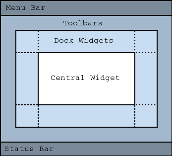

# Fenêtre principale

La classe ```QMainWindow``` a été spécialement conçue pour gérer la fenêtre principale de votre application quand celle-ci est complexe. Parmi les fonctionnalités qui nous sont offertes par la classeQMainWindow, on trouve notamment les menus, la barre d'outils et la barre d'état.

## Présentation

La classe ```QMainWindow``` hérite directement de ```QWidget```. C'est un widget généralement utilisé une seule fois par programme et qui sert uniquement à créer la fenêtre principale de l'application.



Elle est composé :

* **Menu Bar** : c'est la barre de menus. C'est là que vous allez pouvoir créer votre menu Fichier, Édition, Affichage, Aide, etc.

* **Toolbars** : les barres d'outils. Dans un éditeur de texte, on a par exemple des icônes pour créer un nouveau fichier, pour enregistrer, etc.

* **Dock Widgets** : plus complexes et plus rarement utilisés, ces docks sont des conteneurs que l'on place autour de la fenêtre principale. Ils peuvent contenir des outils, par exemple les différents types de pinceaux que l'on peut utiliser quand on fait un logiciel de dessin.

* **Central Widget** : c'est le cœur de la fenêtre, là où il y aura le contenu proprement dit.

* **Status Bar** : c'est la barre d'état. Elle affiche en général l'état du programme (« Prêt/Enregistrement en cours », etc.).

## Exemple de création de menu pour la fenêtre principale

La barre de menus est accessible depuis la méthode ```menuBar()```. Cette méthode renvoie un pointeur sur unQMenuBar, qui vous propose une méthode ```addMenu()```. Cette méthode renvoie un pointeur sur le ```QMenu``` créé.

``` c++
#include "FenPrincipale.h"


FenPrincipale::FenPrincipale()

{
    QMenu *menuFichier = menuBar()->addMenu("&Fichier");
    QMenu *menuEdition = menuBar()->addMenu("&Edition");
    QMenu *menuAffichage = menuBar()->addMenu("&Affichage");

}
```

Un élément de menu est représenté par une action. C'est la classe ```QAction``` qui gère cela.

les ```QAction``` sont des éléments de menus génériques. Ils peuvent être utilisés à la fois pour les menus et pour la barre d'outils.

Les développeurs de Qt se sont en effet rendu compte que les actions des menus étaient souvent dupliquées dans la barre d'outils, d'où la création de la classe ```QAction``` que nous réutiliserons lorsque nous créerons la barre d'outils.

**Remarque** : il est possible d'utiliser les icones du système pour les réutiliser dans votre application avec le code suivant :

``` c++
QIcon::fromTheme("application-exit"));
```

La liste des actions standard est disponible [ici](https://specifications.freedesktop.org/icon-naming-spec/icon-naming-spec-latest.html)

**Remarque 2** : La barre d'outils peut accueillir toutes sortes de widget via sa fonction ```addWidget()``` et il est possible d'ajouter un séparateur via la fonction ```addSeparator()``` à l'endroit que vous souhaitez.

[Exercice 26](../Exercices/Exercice26/README.md)
