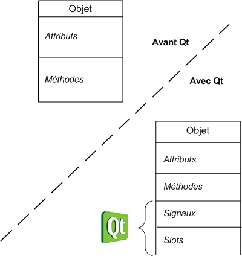
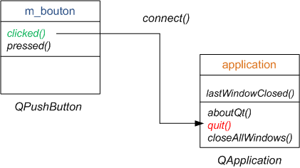

# Les signaux et les Slots

Nous allons maintenant découvrir le mécanisme des signaux et des slots, un principe propre à Qt qui est clairement un de ses points forts. Il s'agit d'une technique séduisante pour gérer les évènements au sein d'une fenêtre.

## Le principe des signaux et slots

Le mécanisme des signaux et des slots, un principe propre à Qt qui est clairement un de ses points forts. Il s'agit d'une technique séduisante pour gérer les évènements au sein d'une fenêtre.

Dans Qt, on parle de signaux et de slots

* **Un signal** : c'est un message envoyé par un widget lorsqu'un évènement se produit.

* **Un slot** : c'est la fonction qui est appelée lorsqu'un évènement s'est produit. On dit que le signal appelle le slot. Concrètement, un slot est une méthode d'une classe.

Exemple : le slot ```quit()``` de la classe ```QApplication``` provoque l'arrêt du programme.

Les signaux et les slots sont considérés par Qt comme des éléments d'une classe à part entière, en plus des attributs et des méthodes.

Voici un schéma qui montre ce qu'un objet pouvait contenir avant Qt, ainsi que ce qu'il peut contenir maintenant qu'on utilise Qt :



Qt rajoute en plus la possibilité d'utiliser ce qu'il appelle des signaux et des slots afin de gérer les évènements.

Un signal est un message envoyé par l'objet (par exemple « on a cliqué sur le bouton »).
Un slot est une… méthode. En fait, c'est une méthode classique comme toutes les autres, à la différence près qu'elle a le droit d'être connectée à un signal.



Le principe de la méthode ```connect()```

```connect()``` est une méthode statique. Ce qui implique son appel se fait comme ceci

``` c++
QObject::connect();
```

La méthode ```connect``` prend 4 arguments :

* un pointeur vers l'objet qui émet le signal ;
* le nom du signal que l'on souhaite « intercepter » ;
* un pointeur vers l'objet qui contient le slot récepteur ;
* le nom du slot qui doit s'exécuter lorsque le signal se produit.

### Utilisation

``` c++
#include "MaFenetre.h"
 
MaFenetre::MaFenetre() : QWidget()
{
    setFixedSize(300, 150);
 
    m_bouton = new QPushButton("Quitter", this);
    m_bouton->setFont(QFont("Comic Sans MS", 14));
    m_bouton->move(110, 50);
 
    // Connexion du clic du bouton à la fermeture de l'application
    QObject::connect(m_bouton, SIGNAL(clicked()), qApp, SLOT(quit()));
}
```

## Des paramètres dans les signaux et slots

les signaux et les slots peuvent s'échanger des paramètres

### Exemple

``` c++
#ifndef DEF_MAFENETRE
#define DEF_MAFENETRE
 
#include <QApplication>
#include <QWidget>
#include <QPushButton>
#include <QLCDNumber>
#include <QSlider>
 
class MaFenetre : public QWidget
{
    public:
    MaFenetre();
 
    private:
    QLCDNumber *m_lcd;
    QSlider *m_slider; 
};
 
#endif
```

``` c++
#include "MaFenetre.h"
 
MaFenetre::MaFenetre() : QWidget()
{
    setFixedSize(200, 100);
 
    m_lcd = new QLCDNumber(this);
    m_lcd->setSegmentStyle(QLCDNumber::Flat);
    m_lcd->move(50, 20);
 
    m_slider = new QSlider(Qt::Horizontal, this);
    m_slider->setGeometry(10, 60, 150, 20);
}
```

On dispose du signal et du slot suivants :

* Le signal valueChanged(int)du QSlider: il est émis dès que l'on change la valeur du curseur du slider en le déplaçant. La particularité de ce signal est qu'il envoie un paramètre de type int(la nouvelle valeur du slider).
* Le slot display(int)du QLCDNumber: il affiche la valeur qui lui est passée en paramètre.

La connextion se fait comme ceci

``` c++
QObject::connect(m_slider, SIGNAL(valueChanged(int)), m_lcd, SLOT(display(int)));
```

[Exercice](../Exercices/Exercice27/README.md)

