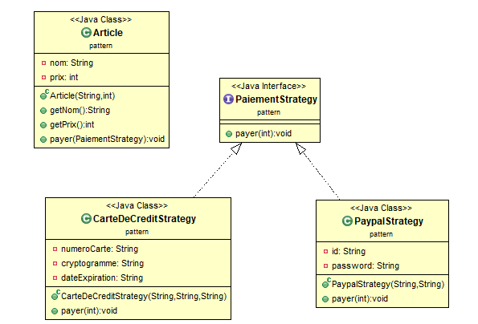

# Exercice 21 (Pattern strategy)

Voici le diagramme UML d'une partie d'un site de paiement en ligne.
Implémentez ce diagramm een utilisant le pattern strategy

[Lien vers la correction](https://repl.it/@arnaudbirk/Exercice21#main.cpp)
