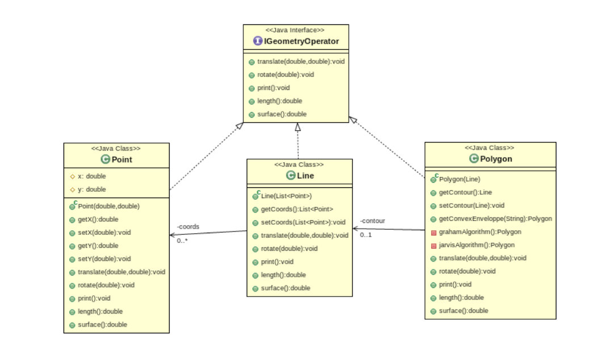

# Exercice 24

On modélise très simplement une API géospatiale dont l’implémentation est modélisée ci-dessous :



Une modélisation simple de ce modèle de données :

[Lien vers la solution initiale](https://replit.com/@alavenant/ExoDPGeometryInit#main.cpp)

## Composite

Nous voulons ajouter à ces éléments géométrique une nouvelle géométrie qui serait une collection de géométrie. Nous appelons ce nouvel objet GeometryCollection. Ajouter ce nouvel objet à partir du pattern Composite.

[Lien vers la correction](https://replit.com/@alavenant/ExoDPGeometryComposite#main.cpp)

Dans cette correction, se trouve une faille. Qu'elle est-elle ? Et comment pourrions-nous la résoudre ?

## Visitor

Afin de ne pas encombre le modèle de données de tous les appels algorithmiques, on va séparer séparer les algorithmes du modèle de données. Pour cela, nous allons utiliser le pattern Singleton. Réalisez ce refactoring. 

=> créer une classe visitor abstraite qui permet de visiter les différentes géométries (attention aux includes récursifs)
=> La classe Geometry ne contiendra plus qu'une fonction accept du visitor abstrait
=> créer les différents visitor (translate, print et rotate)

[Lien vers la correction](https://replit.com/@alavenant/ExoDPStrategy-1#main.cpp)

## Strategy

On trouve que la méthode de calcul de l'enveloppe convexe du polygone n'est pas top... Surtout, l'ajout de nouveaux algorithmes de calcul va allourdir la classe Polygon. Nous voudrions également que cette classe ne dépende pas de tous les algorithmes de calcul convexe.

De plus, on voudrait rendre plus générique le calcul d'enveloppe convexe via le calcul sur un ensemble de points.

On se propose de refactorer cela via un pattern strategy. Réalisez ce refactoring. 

=> créer une classe abstraite stratégie (convexhullstrategie) qui ne contient qu'une fonction execute (=0). Cette fonction peremttra le calcul de l'enveloppe. Elle a donc le même résultat. Par contre, puisque nous voulons la rendre générique, elle doit prendre un vecteur de points.
=> créer ensuite les différentes classes filles en fonction des 2 algorithmes (Jarvis et Graham).
=> enfin, modifier la classe Polygon pour qu'elle puisse prendre en compte ces calculs (cette classe ne voit que la classe abstraite).

[Lien vers la correction](https://replit.com/@alavenant/ExoDPStrategy#main.cpp)

## Simple factory

On décide de déléguer la création des objets héritant de Geometry à une fabrique.

Cette fabrique simple devra contenir les fonctions suivantes :

```cpp
 Point createPoint(double x, double y)
 Line createLine(List<Point> points)
 Polygon createPolygon(Line contour)
 GeometryCollection createGeometryCollection(std::vector<Geometry> geometries)
```

Ainsi, modifier la façon dont sont créees ces géométries ne devrait pas (ou peu) avoir d'influence sur le reste du code. Par exemple, si le constructeur de Polygon change (via une liste de points et non une Line), la fabrique conserve la fonction createPolygon(Line contour) qui se chargera de prendre en compte la modification de modèle de données. Le reste du code ne change pas.

Pourquoi avoir choisi la simple factoty ? Autrement dit, pourquoi le modèle de la factory ne s'applique pas ici ?

## Singleton

Puisque nous n'avons besoin que d'une seule fabrique, nous décidons de rendre faire de la classe factory un singleton. Réaliser ce refactoring.

[Lien vers la correction](https://replit.com/@alavenant/ExoDPGeometryVisitor#geometrySimpleFactory.h)
