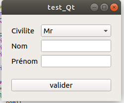

# Exercice 25

Créez un formulaire avec les entrées suivantes :

* civilite [En s'appuyant sur la doc](https://doc.qt.io/qt-5/qcombobox.html) de l'objet ```QCombobox```
* Nom
* Prenom
* Un bouton Valider

Les entrées des champs de saisies devront s'appuyer sur le layout ```QFormLayout```


