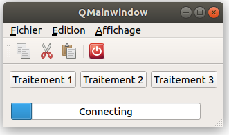

# Exercice 26

Avec les éléments présenté dans le cours, Réaliser cette IHM.

* Le menu Fichier contiendra une action pour quitter l'application
* Le menu Edition contiendra les actions couper, copier et coller
* Le menu Affichage contiendra l'action plein écran
